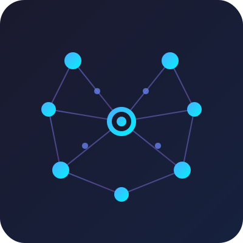

<p align="center">
  
</p>

# Semantic Memory MCP

**Personal Knowledge Management with Semantic Search for AI Assistants**

A self-hosted MCP (Model Context Protocol) server that adds persistent, semantically-searchable memory to Claude and other AI assistants. Store notes, thoughts, and knowledge — search them by meaning, not just keywords.


## ✨ Features

- **Semantic Search** — Find notes by meaning using 384-dimensional embeddings (all-MiniLM-L6-v2)
- **MCP Integration** — Works directly with Claude.ai via Remote MCP Servers
- **Self-Hosted** — Your data stays on your hardware
- **Docker Ready** — One command deployment
- **Embedding Consistency** — Automatic drift detection protects search quality
- **Auto-Backup** — Scheduled backups with easy restore

## 🎯 Use Cases

- **Personal Knowledge Base** — Store and retrieve information semantically
- **Research Notes** — Organize findings, search by concepts
- **Learning Journal** — Track what you learn, find connections
- **Project Context** — Give your AI assistant memory of your projects

## 🚀 Quick Start

### Prerequisites

- Docker & Docker Compose
- ngrok account (for remote access)
- Python 3.9+ (for local development)

### 1. Clone & Configure

```bash
git clone https://github.com/artemMprokhorov/semantic-memory-mcp.git
cd semantic-memory-mcp
cp .env.example .env
# Edit .env with your settings
```

### 2. Start the Server

```bash
docker-compose up -d
```

### 3. Setup ngrok Tunnel

```bash
ngrok http 5000
```

### 4. Connect to Claude.ai

1. Go to Claude.ai → Settings → Integrations
2. Add Remote MCP Server
3. Enter your ngrok URL: `https://your-subdomain.ngrok-free.app/sse`
4. Add your API key as URL parameter: `?api_key=YOUR_KEY`

## 📋 System Requirements

### Minimum
- **RAM:** 4GB (embedding model needs ~2GB)
- **Disk:** 2GB free space (for Docker image + model cache)
- **CPU:** Any modern x64/ARM64 processor
- **OS:** Linux, macOS, Windows (with Docker)

### Recommended
- **RAM:** 8GB+
- **Disk:** 5GB+ (for larger databases)
- **SSD:** Recommended for faster embedding operations

### Software
- Docker & Docker Compose v2.0+
- ngrok account (free tier works)
- Python 3.9+ (only for local development)

### Tested On
- macOS (Apple Silicon M3 Ultra)

### Should Work On (untested)
- Linux distributions with Docker support
- Windows 11 + WSL2 + Docker Desktop
- Other macOS versions (Intel/ARM)

## 📖 Documentation

- [Architecture Overview](docs/ARCHITECTURE.md)
- [Setup Guide](docs/SETUP_GUIDE.md)
- [MCP Integration](docs/MCP_INTEGRATION.md)
- [API Reference](docs/API_REFERENCE.md)
- [Troubleshooting](docs/TROUBLESHOOTING.md)

## 🛠️ Available Tools

Once connected, Claude has access to these tools:

| Tool | Description |
|------|-------------|
| `search_neural_memory` | Semantic search through your notes |
| `add_note` | Save a new note with auto-embedding |
| `update_note` | Modify existing note |
| `delete_note` | Remove a note |
| `neural_stats` | View memory statistics |

## 🏗️ Architecture

```
┌─────────────┐     ┌─────────────┐     ┌─────────────────┐
│  Claude.ai  │────▶│   ngrok     │────▶│  MCP Server     │
└─────────────┘     └─────────────┘     │  (Flask + SSE)  │
                                        └────────┬────────┘
                                                 │
                    ┌────────────────────────────┼────────────────────────────┐
                    │                            ▼                            │
                    │  ┌─────────────┐    ┌─────────────┐    ┌─────────────┐ │
                    │  │  Embedding  │    │   SQLite    │    │ Consistency │ │
                    │  │   Model     │    │  Database   │    │    Check    │ │
                    │  │ (MiniLM-L6) │    │             │    │             │ │
                    │  └─────────────┘    └─────────────┘    └─────────────┘ │
                    │                        Docker Container                 │
                    └─────────────────────────────────────────────────────────┘
```

## 🔒 Security

- API key authentication (URL parameter or header)
- Self-hosted — data never leaves your server
- Optional: SSL/TLS with your own certificates

## 🧪 Embedding Consistency

One unique feature: **automatic embedding drift detection**.

When you rebuild the Docker image or update dependencies, the embedding model might produce slightly different vectors. This breaks semantic search silently — queries return wrong results.

Our solution:
1. On first start, calibration embeddings are saved
2. On every restart, current embeddings are compared to calibration
3. If drift detected → warning + instructions to recompute

See [Troubleshooting](docs/TROUBLESHOOTING.md) for details.

## 📦 Project Structure

```
semantic-memory-mcp/
├── src/
│   ├── mcp_sse_handler.py      # MCP protocol + tools
│   ├── stable_embeddings.py    # Embedding model wrapper
│   ├── embedding_check.py      # Consistency verification
│   └── neural_memory_server.py # Main Flask app
├── scripts/
│   ├── backup.sh               # Backup script
│   ├── restore.sh              # Restore script
│   └── recompute_embeddings.py # Fix drift
├── docs/
├── docker-compose.yml
├── Dockerfile
├── requirements.txt
└── .env.example
```

## 🤝 Contributing

Contributions welcome! Please read [CONTRIBUTING.md](CONTRIBUTING.md) first.

## 📄 Licensing

This project is dual-licensed:

- Open-source / personal / non-commercial use: MIT License  
  See the [LICENSE](LICENSE) file for full terms.
- Commercial use, SaaS integration, proprietary redistribution, closed-source derivative works, or any use that does not comply with MIT terms: requires a separate commercial license.  
  Contact: [system.uid@gmail.com] for pricing, terms, and licensing agreement.

## 🙏 Acknowledgments

- [Anthropic](https://anthropic.com) — for Claude and the MCP protocol
- [Sentence Transformers](https://www.sbert.net/) — for embedding models
- [ngrok](https://ngrok.com) — for tunneling

---

## 👥 Authors

**Artem Prokhorov** — Creator and primary author

**Development approach:** This system emerged through intensive human-AI collaboration. Major architectural contributions—including semantic search, embedding consistency checks, and technical documentation—were developed iteratively with Claude (Anthropic).

Built with 🧠 by Artem Prokhorov
